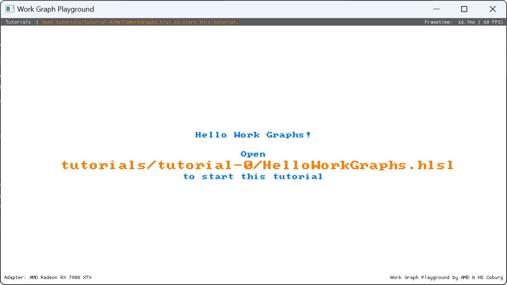
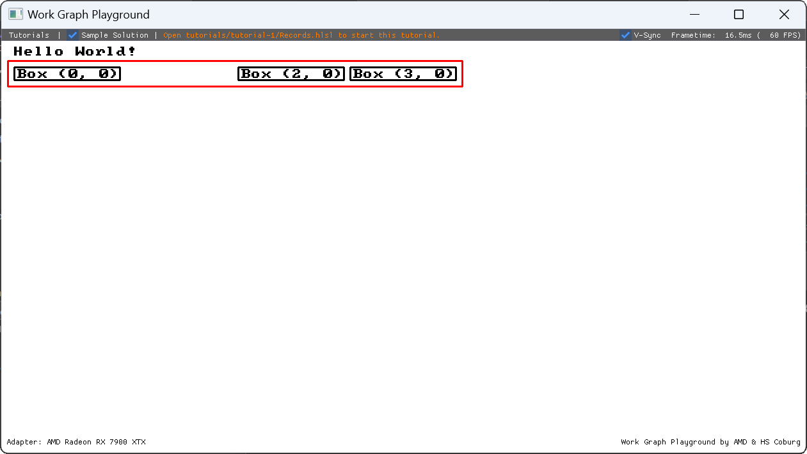
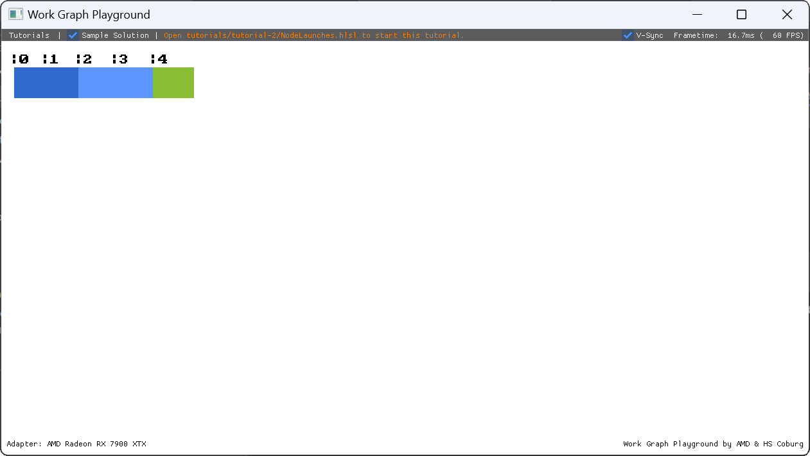
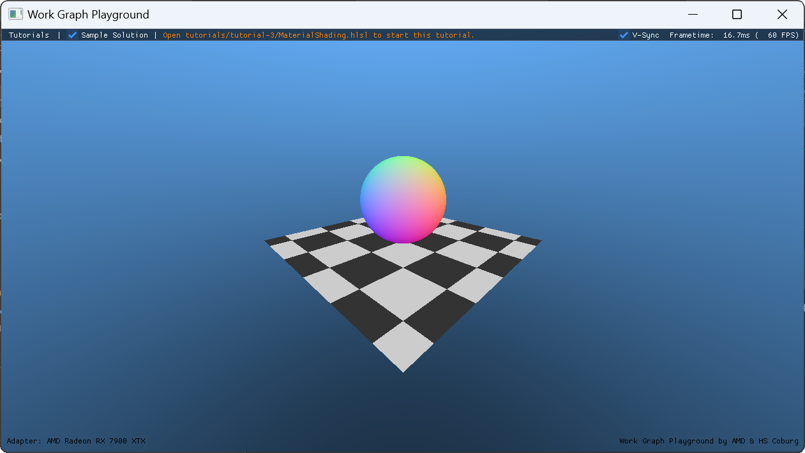
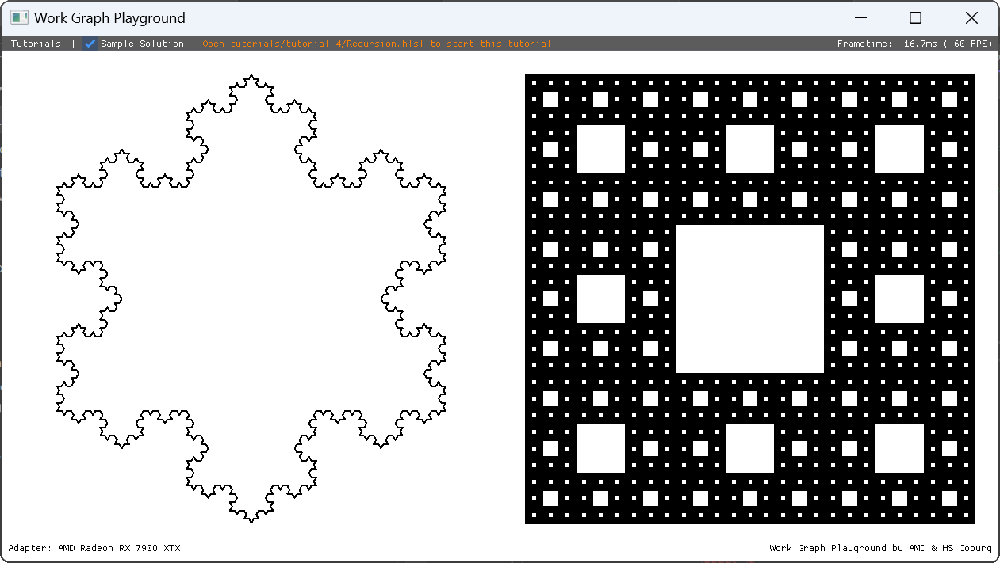
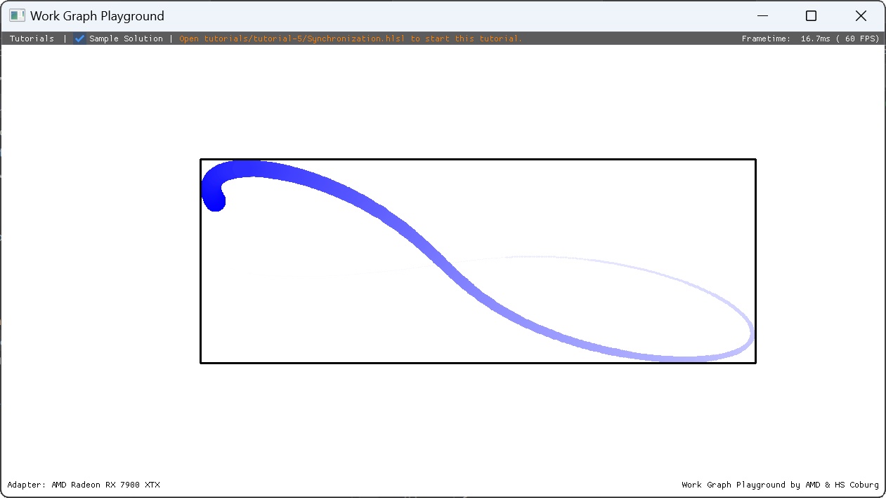
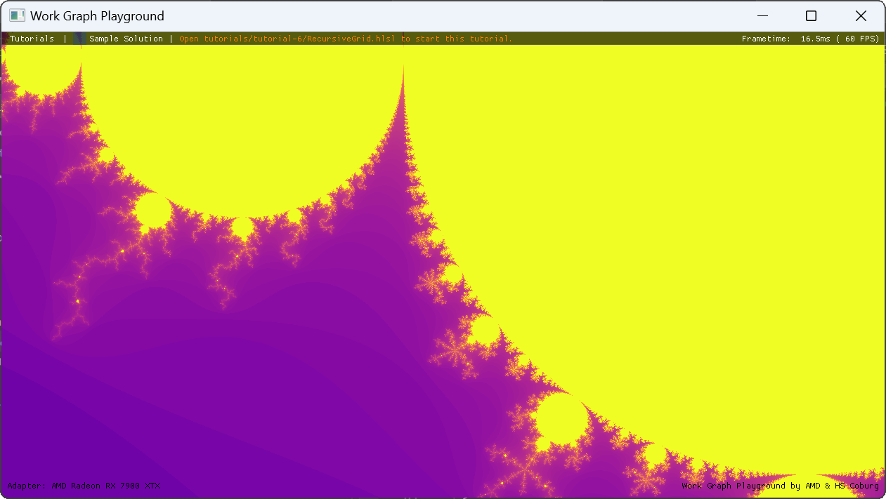

# Work Graph Playground

The Work Graph Playground is a DirectX12-based C++-application that allows graphics programmers to learn and experiment with the new Work Graphs feature using HLSL shaders. In runs on Windows 10 and Windows 11 systems.

## Work Graphs

Work Graphs is a Graphics-API feature released in March 2024 for DirectX12. 
In a nutshell, with Work Graphs, shaders can dynamically schedule new workloads at runtime directly from the GPU.
Prior to Work Graphs, all GPU workloads had to be scheduled by the CPU.
Therefore, Work Graphs can reduce memory requirements, improve caching behavior, better utilize compute resources, reduce communication-needs between CPU-and-GPU, and simplify synchronization.

From a programmer's perspective, Work Graphs extend the host-side of the API, but for most of the time, programmers deal with the shader-code part introduced with Work Graphs.

## Tutorials

We provide several tutorials to walk you through the HLSL-usage of Work Graphs.
As most of the power of Work Graphs is unleashed through HLSL, our tutorials focus on the HLSL aspects of Work Graphs. 
Our Work Graph Playground frees you from dealing with the host-side of Work Graphs.
However, you can use our host-side code as a reference for integrating Work Graphs in your own projects.

In each tutorial, we cover one aspect of Work Graphs.
The tutorials build upon each other, so we recommend taking them one-by-one.
You need just a few prerequisites to run the tutorials.

By the end of the tutorials, if not even already before, you should be inspired to create your own Work Graphs samples and grow from there!
If you want to experiment with Work Graphs, check out [Adding new tutorials](#adding-new-tutorials) below on how to add your own samples or tutorials to the playground application.
Be sure to check out the additional resources and samples linked [below](#resources), if you wish to learn more about Work Graphs.

### Prerequisites

As a person taking this tutorial, you need to know HLSL, C++, Direct3D12, and have a basic understand of how GPU compute shaders work.

Besides a computer, you need:
- A text/code editor of your choice
- A windows version that supports the [Microsoft Agility SDK](https://devblogs.microsoft.com/directx/gettingstarted-dx12agility/#OS)
- Optional: [Graphics diagnostic tools](https://learn.microsoft.com/en-us/windows/uwp/gaming/use-the-directx-runtime-and-visual-studio-graphics-diagnostic-features) for debugging.

To run the sample directly, you'll also need a GPU and driver with D3D12 Work Graphs 1.0 support.
You can learn more about D3D12 Work Graphs 1.0 and driver availability on [Microsoft's blog post](https://devblogs.microsoft.com/directx/d3d12-work-graphs/) or on [our own blog post on GPUOpen.com](https://gpuopen.com/microsoft-work-graphs-1-0-now-available/).

#### Running on GPUs without Work Graphs support

If your GPU does not support Work Graphs, you can download and install the [DirectX WARP adapter](https://learn.microsoft.com/en-us/windows/win32/direct3darticles/directx-warp) as follows:
1. Download the [Microsoft.Direct3D.WARP 1.0.13](https://www.nuget.org/packages/Microsoft.Direct3D.WARP/1.0.13) NuGet package.  
    > BY INSTALLING THE THIRD PARTY SOFTWARE, YOU AGREE TO BE BOUND BY THE LICENSE AGREEMENT(S) APPLICABLE TO SUCH SOFTWARE and you agree to carefully review and abide by the terms and conditions of all license(s) that govern such software. 
  2. Change the file extension to `.zip`, such that the full filename is `microsoft.direct3d.warp.1.0.13.zip`
  3. Open or extract the zip file and locate the `d3d10warp.dll` in `build/native/bin/x64` and copy it next to the `WorkGraphPlayground.exe`

If you're [building the application from source](#building-from-source), the steps above are automated by the CMake build script.

### Running Tutorials

Download the latest release from [here](https://github.com/GPUOpen-LibrariesAndSDKs/WorkGraphPlayground/releases) or follow the instructions for [building the application from source](#building-from-source). 
Start the `WorkGraphPlayground.exe` either directly or from the command line.

You can pass the following options to ```WorkGraphPlayground.exe```:
- ```--forceWarpAdapter``` uses the WARP adapter, even if your GPU does support Work Graphs.
  If you're using pre-built binaries, you'll need to download and install the WARP adapter first. See [instructions](#running-on-gpus-without-work-graphs-support) above.
- ```--enableDebugLayer``` to enable D3D12 Debug Layer (recommended).
- ```--enableGpuValidationLayer``` to turn on D3D12 GPU validation.

You should see the following application window:  


The tutorials only consist of HLSL shader code and are located in the `tutorials` folder.
The shader files are automatically reloaded at runtime whenever any changes were detected, meaning you don't have to restart the application whenever you modify the shader source code.
You will see this in action in the first tutorial. 

If the shader compilation fails, the previous (successfully) compiled shader code is used.
Any error messages or other output from the shader compiler is displayed in the application output log.

We recommend running the app with `--enableDebugLayer` command line argument, to also see any further error messages from the D3D12 debug layer. Note that [Graphics diagnostic tools](https://learn.microsoft.com/en-us/windows/uwp/gaming/use-the-directx-runtime-and-visual-studio-graphics-diagnostic-features) must be installed in order to enable the debug layer.

#### 0. Hello Work Graphs

> [Tutorial file](tutorials/tutorial-0/HelloWorkGraphs.hlsl)

**Description**: This is a minimal introductory tutorial. You get acquainted with our tutorial playground and two very simple Work Graphs nodes. Your task is to launch one worker node from the entry node and print your name from the worker node. You can directly edit the shader file in an editor of your choice. Upon saving, you experience that our playground will automatically reload and recompile your changes made in the shader file.

**Learning Outcome**: You get a feeling for our playground application, shader hot reloading, and reassure that our tutorials run on your device.
You learn how to 
- mark HLSL functions as Work Graphs nodes with [```Shader("node")```](https://microsoft.github.io/DirectX-Specs/d3d/WorkGraphs.html#shader-target)
- add further [attributes](https://microsoft.github.io/DirectX-Specs/d3d/WorkGraphs.html#shader-function-attributes) to shader functions, and 
- get a first glimpse on how to invoke other nodes  

**References to Specification:**
- [Shader Target](https://microsoft.github.io/DirectX-Specs/d3d/WorkGraphs.html#shader-target) 
- [Shader Function Attributes](https://microsoft.github.io/DirectX-Specs/d3d/WorkGraphs.html#shader-function-attributes)
- See ```EmptyNodeOutput``` in [Node output declaration](https://microsoft.github.io/DirectX-Specs/d3d/WorkGraphs.html#node-output-declaration)

#### 1. Records

> [Tutorial file](tutorials/tutorial-1/Records.hlsl) | [Sample Solution](tutorials/tutorial-1/RecordsSolution.hlsl)

**Description**: Work Graphs use *records* to model data-flow. Records serve as inputs and outputs of nodes. In this tutorial, you emit records at a producer node and receive it at different consumer nodes. Your producer node issues multiple consumer nodes that render different things. You parameterize the nodes with records.

**Learning Outcome**: Besides getting a better understanding of how [```EmptyNodeOutput```](https://microsoft.github.io/DirectX-Specs/d3d/WorkGraphs.html#node-output-declaration) works, you learn how to
- declare non-empty records with [```NodeOutput```](https://microsoft.github.io/DirectX-Specs/d3d/WorkGraphs.html#node-output-declaration) at a producer node;
- use the [```MaxRecords```](https://microsoft.github.io/DirectX-Specs/d3d/WorkGraphs.html#node-output-attributes) attribute to cap the number of record outputs at compile time;
- identify situations when to use [```GroupNodeOutputRecords```](https://microsoft.github.io/DirectX-Specs/d3d/WorkGraphs.html#output-record-objects) and [```ThreadNodeOutputRecords```](https://microsoft.github.io/DirectX-Specs/d3d/WorkGraphs.html#output-record-objects) to output records;
- output records during runtime with [```GroupIncrementOutputCount```](https://microsoft.github.io/DirectX-Specs/d3d/WorkGraphs.html#incrementoutputcount);[```ThreadIncrementOutputCount```](https://microsoft.github.io/DirectX-Specs/d3d/WorkGraphs.html#incrementoutputcount), and [```OutputComplete```](https://microsoft.github.io/DirectX-Specs/d3d/WorkGraphs.html#outputcomplete);
- obtain zero or one output record  with [```GetThreadNodeOutputRecords```](https://microsoft.github.io/DirectX-Specs/d3d/WorkGraphs.html#getthreadnodeoutputrecords) (per thread) [```GetGroupNodeOutputRecords```](https://microsoft.github.io/DirectX-Specs/d3d/WorkGraphs.html#getgroupnodeoutputrecords) (per thread-group);
- obtain records at a receiving node with [```ThreadNodeInputRecord```](https://microsoft.github.io/DirectX-Specs/d3d/WorkGraphs.html#input-record-objects); and
- read and write data to records with the [```Get()```-method](https://microsoft.github.io/DirectX-Specs/d3d/WorkGraphs.html#single-record-access) or the [```[]```-operator](https://microsoft.github.io/DirectX-Specs/d3d/WorkGraphs.html#array-records-access).

**References to Specification:**
- [Objects](https://microsoft.github.io/DirectX-Specs/d3d/WorkGraphs.html#objects)
- [Node output declaration](https://microsoft.github.io/DirectX-Specs/d3d/WorkGraphs.html#node-output-declaration)
- [Node input declaration](https://microsoft.github.io/DirectX-Specs/d3d/WorkGraphs.html#node-input-declaration)
- [Methods operating on node output](https://microsoft.github.io/DirectX-Specs/d3d/WorkGraphs.html#methods-operating-on-node-output)
- [Record access](https://microsoft.github.io/DirectX-Specs/d3d/WorkGraphs.html#record-access)



#### 2. Node Launches

> [Tutorial file](tutorials/tutorial-2/NodeLaunches.hlsl) | [Sample Solution](tutorials/tutorial-2/NodeLaunchesSolution.hlsl)

**Description**: You can launch Work Graphs nodes in three different ways: ["thread"](https://microsoft.github.io/DirectX-Specs/d3d/WorkGraphs.html#thread-launch-nodes), ["coalescing"](https://microsoft.github.io/DirectX-Specs/d3d/WorkGraphs.html#coalescing-launch-nodes), and ["broadcast"](https://microsoft.github.io/DirectX-Specs/d3d/WorkGraphs.html#broadcasting-launch-nodes). From an entry node, you will launch three different nodes, each using a different launch mode.

**Learning Outcome**: You will learn
- how and when to use [```NodeMaxDispatchGrid```](https://microsoft.github.io/DirectX-Specs/d3d/WorkGraphs.html#shader-function-attributes) and what the difference to [```NodeDispatchGrid```](https://microsoft.github.io/DirectX-Specs/d3d/WorkGraphs.html#shader-function-attributes) is;
- how to use [```DispatchNodeInputRecord```](https://microsoft.github.io/DirectX-Specs/d3d/WorkGraphs.html#node-input-declaration) as input for nodes launched with [```broadcast```](https://microsoft.github.io/DirectX-Specs/d3d/WorkGraphs.html#broadcasting-launch-nodes);
- how to access individual threads with [```SV_DispatchThreadID```](https://microsoft.github.io/DirectX-Specs/d3d/WorkGraphs.html#node-shader-system-values) for nodes launched in [```broadcast```](https://microsoft.github.io/DirectX-Specs/d3d/WorkGraphs.html#broadcasting-launch-nodes); and
- how to obtain input for nodes launched in [```coalescing```](https://microsoft.github.io/DirectX-Specs/d3d/WorkGraphs.html#coalescing-launch-nodes) launch mode through [```GroupNodeInputRecords```](https://microsoft.github.io/DirectX-Specs/d3d/WorkGraphs.html#input-record-objects).

**References to Specification:**  
- [Node types](https://microsoft.github.io/DirectX-Specs/d3d/WorkGraphs.html#node-types)
- [Objects](https://microsoft.github.io/DirectX-Specs/d3d/WorkGraphs.html#objects)
- [Node shader system value](https://microsoft.github.io/DirectX-Specs/d3d/WorkGraphs.html#node-shader-system-values)
- [SV_DispatchGrid](https://microsoft.github.io/DirectX-Specs/d3d/WorkGraphs.html#sv_dispatchgrid)
- [Node input declaration](https://microsoft.github.io/DirectX-Specs/d3d/WorkGraphs.html#node-input-declaration)



#### 3. Material Shading (Node Arrays)

> [Tutorial file](tutorials/tutorial-3/MaterialShading.hlsl) | [Sample Solution](tutorials/tutorial-3/MaterialShadingSolution.hlsl)

**Description**: The "Classify-and-Execute" pattern is commonly found in graphics. With "Classify-and-Execute", you first determine the class of a work item, and depending the classification result, you execute different shaders. In this tutorial, we use a basic shading example: As work item, we use a pixel that covers a ray-surface intersection. First, a work graph node "classifies" the work-items, i.e., the pixel, into three different material classes. Finally, we "execute" one of three Work-Graph nodes, depending the classification result.
We use the Work-Graphs concept [Node Arrays](https://microsoft.github.io/DirectX-Specs/d3d/WorkGraphs.html#node-arrays) to elegantly solve this "Classify-and-Execute" problem.

**Learning Outcome**: You will learn how to
- use [```NodeOutputArray```](https://microsoft.github.io/DirectX-Specs/d3d/WorkGraphs.html#node-output-declaration) to declare that output records are in fact node arrays;
- set the maximum number of output classes that [```NodeOutputArray```](https://microsoft.github.io/DirectX-Specs/d3d/WorkGraphs.html#output-node-objects) emits with [```NodeArraySize```](https://microsoft.github.io/DirectX-Specs/d3d/WorkGraphs.html#node-output-attributes);
- obtain the classified record [```ThreadNodeOutputRecords```](https://microsoft.github.io/DirectX-Specs/d3d/WorkGraphs.html#output-record-objects) with [```GetThreadNodeOutputRecords```](https://microsoft.github.io/DirectX-Specs/d3d/WorkGraphs.html#getthreadnodeoutputrecords);
- prepare different Nodes and their HLSL functions for use with Node Arrays by extending [```NodeId```](https://microsoft.github.io/DirectX-Specs/d3d/WorkGraphs.html#node-id) with an index; and
- properly use [```ThreadNodeInputRecord```](https://microsoft.github.io/DirectX-Specs/d3d/WorkGraphs.html#single-record-access) for NodeArrays to obtain the input.


**References to Specification:**  
- [Output record objects](https://microsoft.github.io/DirectX-Specs/d3d/WorkGraphs.html#output-record-objects)
- [Objects](https://microsoft.github.io/DirectX-Specs/d3d/WorkGraphs.html#objects)
- [Node input declaration](https://microsoft.github.io/DirectX-Specs/d3d/WorkGraphs.html#record-access)
- [Node output declaration](https://microsoft.github.io/DirectX-Specs/d3d/WorkGraphs.html#node-output-declaration)
- [```GetThreadNodeOutputRecords```](https://microsoft.github.io/DirectX-Specs/d3d/WorkGraphs.html#getthreadnodeoutputrecords)
- [```NodeId```](https://microsoft.github.io/DirectX-Specs/d3d/WorkGraphs.html#node-id)



#### 4. Recursion

> [Tutorial file](tutorials/tutorial-4/Recursion.hlsl) | [Sample Solution](tutorials/tutorial-4/RecursionSolution.hlsl)

**Description**: Nodes can issue records not only for other nodes, but also for themselves. This is called [Work Graph Recursion](https://microsoft.github.io/DirectX-Specs/d3d/WorkGraphs.html#recursion). It supports trivial cycles, i.e., node A can issue work for node A again. However, one limitation is though, that a node A cannot issue work to nodes from which A has already received records from, even transitively. That means, non-trivial cycles are also disallowed.  Also the recursion depth is limited.
However, fractals are a great example to try out trivial cycles for self-recursion!
You see how Work Graphs compute a simple fractal, the Koch Snowflake. You get to compute a second fractal, see Menger Sponge.

**Learning Outcome**:
You learn how to implement trivial cycles, by
- Configure the maximum recursion depth for trivial cycles using [```NodeMaxRecursionDepth```](https://microsoft.github.io/DirectX-Specs/d3d/WorkGraphs.html#node-count-limits);
- use [```GetRemainingRecursionLevels```](https://microsoft.github.io/DirectX-Specs/d3d/WorkGraphs.html#getremainingrecursionlevels) to terminate recursion; and
- recursively call the calling node.

**References to Specification:**  
- [Node count limits](https://microsoft.github.io/DirectX-Specs/d3d/WorkGraphs.html#node-count-limits)
- [Shader function attributes](https://microsoft.github.io/DirectX-Specs/d3d/WorkGraphs.html#shader-function-attributes)
- [```GetRemainingRecursionLevels```](https://microsoft.github.io/DirectX-Specs/d3d/WorkGraphs.html#getremainingrecursionlevels)



#### 5. Synchronization

> [Tutorial file](tutorials/tutorial-5/Synchronization.hlsl) | [Sample Solution](tutorials/tutorial-5/SynchronizationSolution.hlsl)

**Description**: When you want that different thread-groups of a broadcasting node communicate amongst each other, Work Graphs offer an input record type [```RWDispatchNodeInputRecord```](https://microsoft.github.io/DirectX-Specs/d3d/WorkGraphs.html#node-input-declaration) which is also writeable.
Previously, we've seen [```DispatchNodeInputRecord```]((https://microsoft.github.io/DirectX-Specs/d3d/WorkGraphs.html#node-input-declaration)) which is only readable.
We'll use an [```RWDispatchNodeInputRecord```](https://microsoft.github.io/DirectX-Specs/d3d/WorkGraphs.html#node-input-declaration) to store the bounding-box of an object that many threads within a broadcasting node compute cooperatively. 
One thread then gets to draw the bounding box.

**Learning Outcome**:
You learn
- to use [```RWDispatchNodeInputRecord```](https://microsoft.github.io/DirectX-Specs/d3d/WorkGraphs.html#node-input-declaration) such that you can read- and write input records;
- how to, when to, and why to apply the [```globallycoherent```](https://microsoft.github.io/DirectX-Specs/d3d/WorkGraphs.html#node-input-attributes) attribute on [```RWDispatchNodeInputRecord```](https://microsoft.github.io/DirectX-Specs/d3d/WorkGraphs.html#node-input-declaration) records;
- to read and write [```RWDispatchNodeInputRecord```s](https://microsoft.github.io/DirectX-Specs/d3d/WorkGraphs.html#node-input-declaration) with atomic operations at the example of InterlockedMin and InterlockedMax;
- to prepare record-structs with the [```NodeTrackRWInputSharing```](https://microsoft.github.io/DirectX-Specs/d3d/WorkGraphs.html#nodetrackrwinputsharing)-attribute for the usage of [```FinishedCrossGroupSharing```](https://microsoft.github.io/DirectX-Specs/d3d/WorkGraphs.html#finishedcrossgroupsharing); and
- how to synchronize the input record across all the thread-groups of a broadcast launch with [```Barrier```](https://microsoft.github.io/DirectX-Specs/d3d/WorkGraphs.html#barrier) and [```FinishedCrossGroupSharing```](https://microsoft.github.io/DirectX-Specs/d3d/WorkGraphs.html#finishedcrossgroupsharing).

**References to Specification:**  
- [Shaders can use input record lifetime for scoped scratch storage](https://microsoft.github.io/DirectX-Specs/d3d/WorkGraphs.html#shaders-can-use-input-record-lifetime-for-scoped-scratch-storage)
- [Input Record objects](https://microsoft.github.io/DirectX-Specs/d3d/WorkGraphs.html#input-record-objects)
- [Node input declaration](https://microsoft.github.io/DirectX-Specs/d3d/WorkGraphs.html#node-input-declaration)
- [Node input attributes](https://microsoft.github.io/DirectX-Specs/d3d/WorkGraphs.html#node-input-attributes)
- [Record struct](https://microsoft.github.io/DirectX-Specs/d3d/WorkGraphs.html#record-struct)
- [```FinishedCrossGroupSharing```](https://microsoft.github.io/DirectX-Specs/d3d/WorkGraphs.html#finishedcrossgroupsharing)
- [Objects](https://microsoft.github.io/DirectX-Specs/d3d/WorkGraphs.html#objects)
- [Barrier](https://microsoft.github.io/DirectX-Specs/d3d/WorkGraphs.html#barrier)



#### 6. Recursive Grid (Mandelbrot)

> [Tutorial file](tutorials/tutorial-6/RecursiveGrid.hlsl) | [Sample Solution](tutorials/tutorial-6/RecursiveGridSolution.hlsl)

**Description**: 
Another pattern commonly found in computer graphics is recursive subdivision of a geometric primitive. Among the countless examples, we picked computing a Mandelbrot set. We provide the algorithmic part of that in the header-file ```Mandlebrot.h``` and a "brute-force" solution. However, a simple property of Mandelbrot sets gives raise to a subdivision algorithm that optimizes the computation of the Mandelbrot set. Use Work Graphs to exploit this property and make the algorithm more efficient.

**Learning Outcome**: In this final tutorial, we would like to see you try out your Work Graphs expertise. Your learning outcome should be that your able to solve a common graphics problem with Work Graphs. From there on, you should become able to assess for what tasks Work Graphs are a fit for you.

**References to Specification:**
- (D3D12 Work Graphs)[https://microsoft.github.io/DirectX-Specs/d3d/WorkGraphs.html]



### Adding new tutorials

To add a new tutorial, create a new folder inside the `tutorials` folder.
The position of your tutorial in the tutorial list in the application UI will be based on this folder name.

Inside this folder, create a new `.hlsl` file. The filename in camel-case will be used as a name for the tutorial (e.g., `MyNewTutorial.hlsl` will result in `My New Tutorial`).  
If you wish to provide a sample solution, create a second `.hlsl` file with the suffix `Solution` (e.g., `MyNewTutorialSolution.hlsl`).  
If your tutorial requires more than one file, you can always create additional `.h` header files and include them in your tutorial files.

Restart the application to see your tutorial appear in the tutorial list.

Each tutorial must define a node named `Entry` with no input record.
This node will be invoked once per frame.

The `Common.h` header file provides access to shader resources (output render target & scratch buffers) and utility methods for drawing text or primitives (lines & rectangles).

Shaders are compiled using the [Microsoft DirectX shader compiler](https://github.com/microsoft/DirectXShaderCompiler) with the following arguments:  
```
-T lib_6_8 -enable-16bit-types -HV 2021 -Zpc -I./tutorials/
```
See [ShaderCompiler.cpp](src/ShaderCompiler.cpp) for more details.

## Building from Source

Here, we show how you can directly build our Work Graph Playground from source.

### Prerequisites

- [CMake 3.17](https://cmake.org/download/)
- [Visual Studio 2019](https://visualstudio.microsoft.com/downloads/)
- [Windows 10 SDK 10.0.18362.0](https://developer.microsoft.com/en-us/windows/downloads/windows-10-sdk)
- A windows version that supports the [Microsoft Agility SDK](https://devblogs.microsoft.com/directx/gettingstarted-dx12agility/#OS)

### Building and running

Clone the repository, including [ImGui](https://github.com/ocornut/imgui) submodule:
```
git clone https://github.com/GPUOpen-LibrariesAndSDKs/WorkGraphPlayground.git --recurse-submodules
```

Configuring with CMake:
```
cmake -B build .
```
This command will download the following NuGet packages:
- [Microsoft.Direct3D.D3D12 1.613.3](https://www.nuget.org/packages/Microsoft.Direct3D.D3D12/1.613.3)
- [Microsoft.Direct3D.DXC 1.8.2403.18](https://www.nuget.org/packages/Microsoft.Direct3D.DXC/1.8.2403.18)
- [Microsoft.Direct3D.WARP 1.0.13](https://www.nuget.org/packages/Microsoft.Direct3D.WARP/1.0.13)

> In order to use this software, you may need to have certain third party software installed on your system. Whether you install this software directly or whether a script is provided that, when executed by you, automatically fetches and installs software onto your system BY INSTALLING THE THIRD PARTY SOFTWARE, YOU AGREE TO BE BOUND BY THE LICENSE AGREEMENT(S) APPLICABLE TO SUCH SOFTWARE and you agree to carefully review and abide by the terms and conditions of all license(s) that govern such software.  You acknowledge and agree that AMD is not distributing to you any of such software and that you are solely responsible for the installation of such software on your system.

Opening VS Solution:
```
cmake --open build
```

In Visual Studio, build and run the `Work Graph Playground` project.

See [adding new tutorials](#adding-new-tutorials) to add new tutorials. Re-run `cmake -B build .` to add any new files to the Visual Studio solution.

## Resources

While Work Graphs is a new feature, there are already some resources available.

Work Graphs General:
- [GPU Work Graphs in Microsoft DirectX® 12](https://gpuopen.com/learn/gpu-work-graphs)
- [Work graphs API – compute rasterizer learning sample](https://gpuopen.com/learn/work_graphs_learning_sample/)
- [GDC 2024 - GPU Work Graphs: Welcome to the Future of GPU Programming](https://www.youtube.com/watch?v=QQP6-JF64DQ)
- [HPG 2024 - Work Graphs: Hands-On with the Future of Graphics Programming](https://www.youtube.com/watch?v=ikwIpn_elgA)

Mesh Nodes:
- [GDC 2024 - Work Graphs and draw calls – a match made in heaven!](https://gpuopen.com/learn/gdc-2024-workgraphs-drawcalls/)
- [GPU Work Graphs mesh nodes in Microsoft DirectX® 12](https://gpuopen.com/learn/work_graphs_mesh_nodes)
- [HPG 2024 - Real-Time Procedural Generation with GPU Work Graphs](https://www.youtube.com/watch?v=653fSmEalbo)

Work Graphs Samples:
- [WorkGraphsHelloWorkGraphs](https://github.com/GPUOpen-LibrariesAndSDKs/WorkGraphsHelloWorkGraphs)
- [WorkGraphComputeRasterizer](https://github.com/GPUOpen-LibrariesAndSDKs/WorkGraphComputeRasterizer)
- [WorkGraphsMeshNodeSample](https://github.com/GPUOpen-LibrariesAndSDKs/WorkGraphsMeshNodeSample)
- [WorkGraphsHelloMeshNodes](https://github.com/GPUOpen-LibrariesAndSDKs/WorkGraphsHelloMeshNodes)
- [WorkGraphsIvyGenerationSample](https://github.com/GPUOpen-LibrariesAndSDKs/WorkGraphsIvyGenerationSample)
- [WorkGraphsDirectX-Graphics-Samples](https://github.com/GPUOpen-LibrariesAndSDKs/WorkGraphsDirectX-Graphics-Samples)